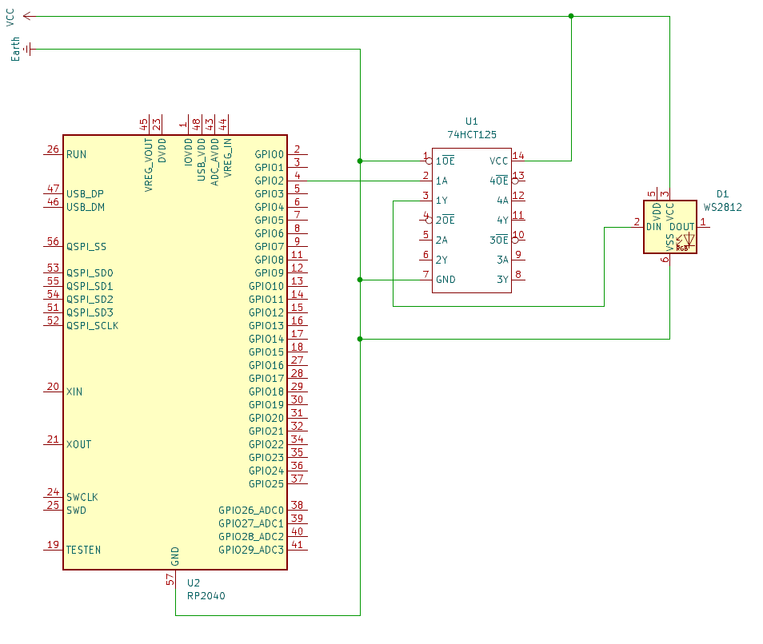

# pico-multi-monitor-ambilight
Implementation of an ambilight system for a multi monitor PC setup utilising Raspberry Pi Pico W with RP2040 chip for led control.

## Table of Contents
- [pico-multi-monitor-ambilight](#pico-multi-monitor-ambilight)
  - [Table of Contents](#table-of-contents)
  - [Features](#features)
  - [Installation](#installation)
    - [PC side](#pc-side)
    - [Pico side](#pico-side)
  - [Hardware Requirements](#hardware-requirements)
    - [Required components](#required-components)
    - [Connection diagram](#connection-diagram)
  

## Features
- Multi-monitor support,
- Customizable settings for unconventional setups.

## Installation
### PC side
1. Clone the repository:
   ```
   git clone https://github.com/Dansheez/pico-multi-monitor-ambilight.git
   ``` 
2. Navigate to the project's directory and install dependencies:
   ```
   cd pico-multi-monitor-ambilight
   pip install -r pc/requirements.txt
   ``` 
3. Setup the configuration file contents:
   ```
   <your text editor> pc/include/config.py
   ```
4. Run the project:
   ```
   python pc/main.py
   ```

### Pico side
1. Follow the [Raspberry Pi Pico C/C++ SDK documentation](https://github.com/raspberrypi/pico-sdk) to install necessary build tools. You will need:
- CMake
- The Pico-SDK
2. Navigate to the pico side project's directory and setup the configuration file contents:
```
   cd pico-multi-monitor-ambilight/pico
   <your text editor> include/config.py
```
3. Create build directory, navigate to it and build the project:
```
   mkdir build
   cd build
   cmake ..
   make
```
4. Flash the project to your Pico W manually or using the [picotool](https://github.com/raspberrypi/picotool):
```
   picotool load -f pico-multi-monitor-ambilight.uf2
```

## Hardware Requirements
### Required components
- Raspbery Pi Pico with RP2040 or RP2350 chip,
- 74HTC buffer (I used 74HTC125),
- Power supply with 5V for powering LEDs,
- WS2812 LED strip.

### Connection diagram

